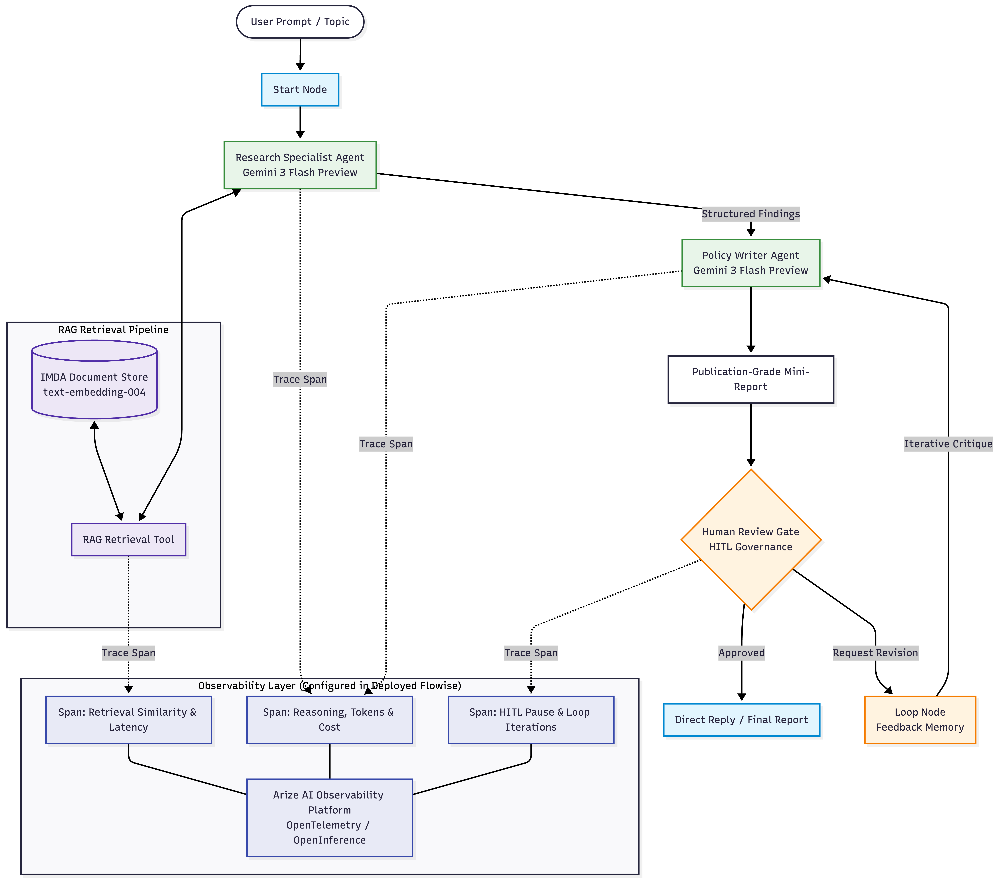

# Autonomous Multi-Agent RAG System & Evaluation Suite
### Digital Economy Policy Research with Human-in-the-Loop (HITL)

[](LICENSE)
[](https://www.python.org/)
[](https://github.com/astral-sh/uv)
[](https://flowiseai.com/)
[](https://arize.com/)
[](https://aistudio.google.com/)
[](https://ai.google.dev/)
[](https://cloud.google.com/run)
[](https://aisg-ladp-capstone5-303326639199.asia-southeast1.run.app/chatbot/26cb92c3-305d-4ed3-a3de-11522faa362b)

An end-to-end, production-oriented GenAI application demonstrating a **specialized multi-agent architecture** with **Document Store RAG**, **Human-in-the-Loop (HITL) iterative governance**, **live Arize AI observability & tracing**, **RAG Triad automated evaluation**, and **automated zero-secrets deployment to Google Cloud Run**.

Designed around the dense 50+ page policy report published by the **Infocomm Media Development Authority (IMDA)** and the **Tech for Good Institute**: *"From Tech for Growth to Tech for Good: Shaping the Next Phase of Southeast Asia’s Growth through the Digital Economy"*.

> [!NOTE]
> **Upstream AISG Capstone Contribution**: This repository serves as the standalone, open-source companion and full deployment/evaluation suite for the author's capstone project merged into the official AI Singapore repository: [**AISG-AIAP/LADP-Essentials (`yeehong_ho`)**](https://github.com/AISG-AIAP/LADP-Essentials/tree/main/LADPE_Project_Phase/contributions_from_learners/yeehong_ho).

---

## 🚀 Live Demo

Experience the autonomous research agent in action without installing anything:

👉 **[Launch Interactive Flowise Chatbot](https://aisg-ladp-capstone5-303326639199.asia-southeast1.run.app/chatbot/26cb92c3-305d-4ed3-a3de-11522faa362b)**

> [!TIP]
> **Sample Query to Try:**
> *"Write a brief report on the shift from 'Tech for Growth' to 'Tech for Good' in Southeast Asia."*
> 
> *Note: If the chatbot takes ~15–20 seconds on the initial request, it is Cloud Run cold-starting from 0 instances (cost-optimized autoscaling).*

---

## 🏛️ System Architecture

<p align="center">
  
</p>

<details>
<summary><b>View Mermaid Diagram Source</b></summary>

```mermaid
graph TD
    classDef startNode fill:#e1f5fe,stroke:#0288d1,stroke-width:2px;
    classDef agentNode fill:#e8f5e9,stroke:#388e3c,stroke-width:2px;
    classDef hitlNode fill:#fff3e0,stroke:#f57c00,stroke-width:2px;
    classDef toolNode fill:#ede7f6,stroke:#512da8,stroke-width:2px;
    classDef arizeNode fill:#e8eaf6,stroke:#3949ab,stroke-width:2px;

    User([User Prompt / Topic]) --> Start[Start Node]:::startNode
    Start --> ResearchAgent[Research Specialist Agent<br/>Gemini 3 Flash Preview]:::agentNode
    
    subgraph RAG Retrieval Pipeline
        Store[(IMDA Document Store<br/>text-embedding-004)]:::toolNode
        Tool[RAG Retrieval Tool]:::toolNode
        Store <--> Tool
    end
    
    ResearchAgent <--> Tool
    ResearchAgent -->|Structured Findings| WriterAgent[Policy Writer Agent<br/>Gemini 3 Flash Preview]:::agentNode
    
    WriterAgent --> DraftReport[Publication-Grade Mini-Report]
    DraftReport --> HITL{Human Review Gate<br/>HITL Governance}:::hitlNode
    
    HITL -->|Approved| Approved[Direct Reply / Final Report]:::startNode
    HITL -->|Request Revision| Loop[Loop Node<br/>Feedback Memory]:::hitlNode
    Loop -->|Iterative Critique| WriterAgent

    subgraph Observability Layer (Configured in Deployed Flowise)
        Arize[Arize AI Observability Platform<br/>OpenTelemetry / OpenInference]:::arizeNode
        SpanTool[Span: Retrieval Similarity & Latency]:::arizeNode
        SpanLLM[Span: Reasoning, Tokens & Cost]:::arizeNode
        SpanHITL[Span: HITL Pause & Loop Iterations]:::arizeNode
        
        SpanTool --- Arize
        SpanLLM --- Arize
        SpanHITL --- Arize
    end

    Tool -.->|Trace Span| SpanTool
    ResearchAgent -.->|Trace Span| SpanLLM
    WriterAgent -.->|Trace Span| SpanLLM
    HITL -.->|Trace Span| SpanHITL
```
</details>

### Key Architectural Highlights
* **Specialized Separation of Concerns:**
  * **Research Agent:** High-recall factual retrieval across country benchmarks (Singapore, Malaysia, Indonesia, Thailand, Philippines, Vietnam) and the four structural pillars (Infrastructure, Talent, Trust/Cybersecurity, Governance).
  * **Writer Agent:** Executive policy synthesis structured strictly into: *Executive Summary*, *Key Findings & Regional Analysis*, *Strategic Enablers & Recommendations*, and *Future Outlook*.
* **Enterprise Human-in-the-Loop (HITL) Gate:** Prevents unchecked autonomous generation by providing an interactive review barrier where human domain experts can approve or request targeted revisions.
* **Full-Stack Arize AI Observability:** Configured directly within the deployed Flowise interface on Google Cloud Run to stream OpenInference and OpenTelemetry traces into **Arize AI**, monitoring latency, token economics, retrieval chunk quality, and feedback iteration counts in production.
* **Asymmetric Semantic Embeddings:** Uses Google's `text-embedding-004` with asymmetric indexing (`RETRIEVAL_DOCUMENT` vs `RETRIEVAL_QUERY`) for higher retrieval precision at 768 dimensions with 50% lower memory footprint than traditional 1536-dim vectors.

---

## 📂 Repository Structure

```
├── deploy/
│   ├── deploy_gcp.sh              # Production-grade deployment script for Google Cloud Run
│   ├── env.example                # Sanitized deployment configuration template
│   ├── flowise.html               # Lightweight embeddable chat web interface
│   └── README_DEPLOY_GCP.md       # Comprehensive GCP infrastructure deployment guide
├── evals/
│   ├── run_evaluations.py         # Automated RAG Triad evaluation runner (TruLens/RAGAS methodology)
│   ├── evaluation_dataset.json    # Benchmark dataset with queries, retrieved context & golden references
│   ├── evaluation_dataset.csv     # Tabular version of benchmark scenarios
│   ├── evaluation_report.md       # Generated benchmark report and scorecard
│   └── evaluations_notebook.ipynb # Interactive Jupyter analysis notebook
├── images/
│   └── rag_retrieval_pipeline.png # High-resolution system architecture diagram
├── prompts/
│   ├── research_agent_prompt.txt  # System directives for factual extraction & country breakouts
│   └── writer_agent_prompt.txt    # Policy writer persona, report schema & revision rules
├── flowise_scenario_5_workflow.json # Sanitized Flowise Agentflow v2 workflow export
├── main.py                        # Central project CLI entrypoint
├── pyproject.toml                 # Project metadata and dependencies (PEP 518/621)
├── uv.lock                        # Deterministic lockfile managed by uv
├── LICENSE                        # MIT License
└── README.md                      # Project documentation
```

---

## 🚀 Quickstart Guide

This project uses [`uv`](https://github.com/astral-sh/uv) for fast, reliable Python package and environment management.

### 1. Prerequisites
* Python `>= 3.10`
* [uv](https://docs.astral.sh/uv/getting-started/installation/) installed (`curl -LsSf https://astral.sh/uv/install.sh | sh` or `brew install uv`)
* [Flowise](https://flowiseai.com/) (Local via `npx flowise start` or Docker container)

### 2. Environment Setup
Clone the repository and synchronize dependencies:
```bash
git clone https://github.com/hoyeehong/aisg-flowise-rag-agent-gcp.git
cd aisg-flowise-rag-agent-gcp

# Install dependencies into an isolated virtual environment
uv sync
```

---

## 🧪 Automated RAG Triad Evaluation Suite

The evaluation suite implements the **RAG Triad** framework (TruLens / RAGAS standard) to rigorously score hallucination resistance, retrieval relevance, and structural completeness.

### Evaluation Metrics & Rubric
| Metric | Score | Target | Status | Assessment |
| :--- | :---: | :---: | :---: | :--- |
| **Context Relevance** | **0.908** | $\ge 0.80$ | `PASS` | Evaluates if retrieved text chunks from `text-embedding-004` contain strictly relevant facts. |
| **Groundedness / Faithfulness** | **0.880** | $\ge 0.85$ | `PASS` | Evaluates whether claims made by the Writer Agent are grounded in retrieved context (Hallucination check). |
| **Answer Relevance** | **0.871** | $\ge 0.80$ | `PASS` | Evaluates whether the generated mini-report directly addresses the user query and intent. |
| **RAG Triad Composite** | **0.887** | $\ge 0.80$ | **`PASSED`** | Harmonic composite score across all three triad dimensions. |
| **Token F1 vs Reference** | **0.990** | $\ge 0.70$ | `PASS` | Lexical & token overlap against calibrated expert reference reports. |
| **Structure Completeness** | **100%** | $\ge 80\%$ | `PASS` | Validates presence of Executive Summary, Key Findings, Strategic Enablers, and Conclusion. |

### Running Evaluations

Run the automated evaluation runner:
```bash
uv run python evals/run_evaluations.py
```

To run with **Google Gemini as an active LLM-as-a-Judge**:
```bash
export GEMINI_API_KEY="your-google-gemini-api-key"
uv run python evals/run_evaluations.py --gemini-key $GEMINI_API_KEY
```

To explore interactively in Jupyter:
```bash
uv run jupyter lab evals/evaluations_notebook.ipynb
```

---

## 🔭 Observability, Tracing & Production Engineering (Arize AI)

Monitoring complex agentic workflows in production requires granular visibility into node transitions, vector retrieval quality, and LLM reasoning steps.

### Arize AI Integration via Deployed Flowise Interface
In the production deployment on **Google Cloud Run**, observability is enabled natively via the Flowise UI (**Configuration / Settings $\rightarrow$ Analytics $\rightarrow$ Arize AI / OpenInference**):

* **OpenTelemetry & OpenInference Telemetry:** Every execution event emits standardized traces into the Arize platform:
  * **Span 1 (`startAgentflow`):** Prompt ingestion, session metadata, and user query timestamp.
  * **Span 2 (`agentAgentflow` / RAG Tool):** Embedding conversion with `text-embedding-004`, top-K retrieved chunk similarity scores, retrieved context payload, and retrieval latency.
  * **Span 3 (`llmAgentflow`):** Writer Agent reasoning step, prompt/completion token consumption, temperature parameters, and execution latency.
  * **Span 4 (`humanInputAgentflow` & `loopAgentflow`):** Human-in-the-Loop approval/revision events, user critique payload, and multi-turn iteration counters.

### Production Observability Capabilities with Arize:
1. **RAG Retrieval Quality & Semantic Drift:** Continuously inspects whether retrieved context chunks remain tightly aligned with policy queries over time.
2. **Multi-Agent Cost & Token Tracking:** Monitors token consumption broken down by agent role (Research vs Writer) across successive HITL feedback loops.
3. **Continuous Groundedness & Hallucination Guardrails:** Correlates production trace inputs against generated answers to identify hallucinated citations or ungrounded claims in real time.

---

## ☁️ Cloud Deployment (Google Cloud Run)

The [`deploy/`](deploy/) directory provides a production deployment setup for Google Cloud Platform (`asia-southeast1`):

* **Zero Plaintext Secrets:** Model API keys and admin credentials are injected at container startup via **Google Secret Manager**.
* **Persistent Storage:** Cloud Run integrates a **Google Cloud Storage (GCS) FUSE** mount (`gs://flowise-data-<PROJECT_ID>`) to persist Flowise SQLite databases, sessions, and document stores across restarts.
* **Cost Efficiency:** Automated scale-to-zero (`min-instances: 0`, `max-instances: 5`).

### Deploy in One Command:
```bash
# Optional: copy configuration template
cp deploy/env.example deploy/.env

# Execute deployment
bash deploy/deploy_gcp.sh
```

For complete step-by-step deployment and operational management instructions, see [`deploy/README_DEPLOY_GCP.md`](deploy/README_DEPLOY_GCP.md).

---

## ⚙️ How to Import into Flowise

1. Launch Flowise locally (`npx flowise start`) or on Cloud Run.
2. Under **Credentials**, add your **Google Generative AI API** key.
3. Under **Document Stores**, create `imda_sea_digital_economy_report`:
   * Loader: **PDF File Loader** $\rightarrow$ upload `imda_report.pdf`
   * Text Splitter: **Recursive Character Text Splitter** (`Chunk: 1000`, `Overlap: 200`)
   * Embeddings: **Google GenerativeAI Embeddings** (`text-embedding-004`)
   * Vector Store: **In-Memory** or **Pinecone Cloud**
4. Under **Agentflows**, click **Add New** $\rightarrow$ **Settings** $\rightarrow$ **Load / Import Chatflow** $\rightarrow$ Select [`flowise_scenario_5_workflow.json`](flowise_scenario_5_workflow.json).
5. Click **Save** and test in the chat canvas.

---

## 📜 Acknowledgements & References
* **AI Singapore (AISG):** Developed for the *LLM Application Developer Programme (Essentials)* (LADP-E) Capstone Project. Official learner submission merged upstream in [**AISG-AIAP/LADP-Essentials (`yeehong_ho`)**](https://github.com/AISG-AIAP/LADP-Essentials/tree/main/LADPE_Project_Phase/contributions_from_learners/yeehong_ho).
* **IMDA & Tech for Good Institute:** Source policy report: *"From Tech for Growth to Tech for Good: Shaping the Next Phase of Southeast Asia’s Growth through the Digital Economy"*.
* **Flowise AI:** Low-code/no-code visual framework for LangChain and LangGraph agentic workflows.

---

## 📄 License
This project is licensed under the [MIT License](LICENSE).
