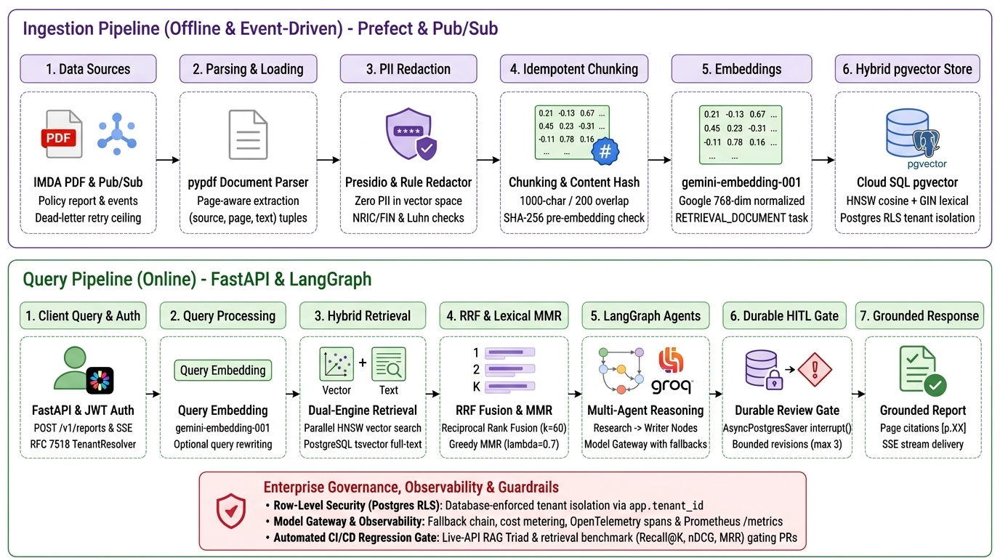
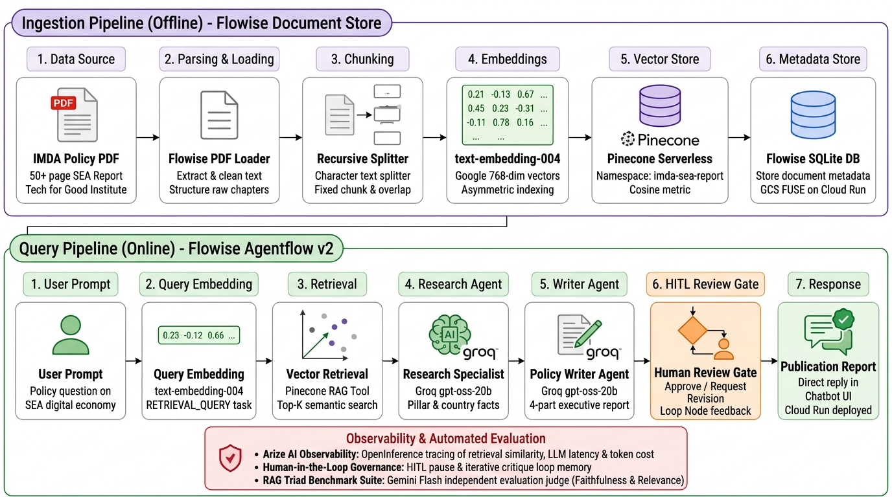

# Autonomous Multi-Agent RAG System & Evaluation Suite
### Digital Economy Policy Research with Human-in-the-Loop (HITL)

[](LICENSE)
[](https://www.python.org/)
[](https://github.com/astral-sh/uv)
[](https://fastapi.tiangolo.com/)
[](https://langchain-ai.github.io/langgraph/)
[](https://github.com/pgvector/pgvector)
[](https://flowiseai.com/)
[](https://groq.com/)
[](https://aistudio.google.com/)
[](https://prometheus.io/)
[](https://cloud.google.com/run)
[](https://aisg-ladp-capstone5-303326639199.asia-southeast1.run.app/chatbot/26cb92c3-305d-4ed3-a3de-11522faa362b)

An end-to-end, production-grade GenAI application showcasing the complete engineering lifecycle from **Low-Code Rapid Prototype (v1 in Flowise)** to an enterprise **Pro-Code Production Service (v2 in FastAPI + LangGraph)**.

Built around the dense 50+ page policy report published by the **Infocomm Media Development Authority (IMDA)** and the **Tech for Good Institute**: *"From Tech for Growth to Tech for Good: Shaping the Next Phase of Southeast Asia’s Growth through the Digital Economy"*.

The system demonstrates a **specialized multi-agent architecture**, **pgvector hybrid retrieval** (dense vector + lexical FTS with RRF fusion), **Human-in-the-Loop (HITL) durable governance**, **event-driven ingestion with PII redaction**, **Postgres Row-Level Security (RLS) multi-tenancy**, **end-to-end OpenTelemetry & Prometheus observability**, and **automated CI/CD regression gating**.

> [!NOTE]
> **Upstream AISG Capstone Contribution**: This repository serves as the standalone, open-source companion and full deployment/evaluation suite for the author's capstone project merged into the official AI Singapore repository: [**AISG-AIAP/LADP-Essentials (`yeehong_ho`)**](https://github.com/AISG-AIAP/LADP-Essentials/tree/main/LADPE_Project_Phase/contributions_from_learners/yeehong_ho).

---

## 🚀 Live Demo

Experience the autonomous research agent in action without installing anything:

👉 **[Launch Interactive Flowise Chatbot](https://aisg-ladp-capstone5-303326639199.asia-southeast1.run.app/chatbot/26cb92c3-305d-4ed3-a3de-11522faa362b)**

> [!TIP]
> **Sample Query to Try:**
> *"Write a brief report on the shift from 'Tech for Growth' to 'Tech for Good' in Southeast Asia."*
> 
> *Note: If the chatbot takes ~15–20 seconds on the initial request, it is Cloud Run cold-starting from 0 instances (cost-optimized autoscaling).*

---

## 🏛️ System Architecture & Progression

This repository demonstrates the complete architectural evolution of an enterprise multi-agent RAG application, organized into two deliberately separate tiers:

### Tier 2: Pro-Code Production Service (Flagship)
> **FastAPI · LangGraph · Cloud SQL pgvector · Cloud Pub/Sub · Postgres RLS Multi-Tenancy**

<p align="center">
  
</p>

* **Ingestion Pipeline (Offline & Event-Driven):** `pypdf` page-aware parsing $\rightarrow$ Presidio PII redaction $\rightarrow$ 1000-char chunking with SHA-256 pre-hash $\rightarrow$ normalized `gemini-embedding-001` (768-dim) $\rightarrow$ Cloud SQL pgvector (HNSW cosine + GIN `tsvector` lexical).
* **Query Pipeline (Online):** FastAPI + JWT Bearer tenant resolution $\rightarrow$ Dual-engine hybrid search $\rightarrow$ Reciprocal Rank Fusion (RRF $k=60$) & Lexical MMR ($\lambda=0.7$) $\rightarrow$ LangGraph StateGraph (Research + Writer nodes) with Model Gateway $\rightarrow$ Durable `AsyncPostgresSaver` review gate $\rightarrow$ Grounded SSE streaming report with citations `[p.XX]`.
* **Governance & Platform:** Database-enforced Postgres Row-Level Security (`agent_app` role), OpenTelemetry spans + Prometheus exposition `/metrics`, and PR retrieval evaluation gating.

---

### Tier 1: Low-Code Rapid Prototype (Validation Baseline)
> **Flowise Agentflow v2 · Pinecone Serverless · Groq gpt-oss-20b · Arize AI Observability**

<p align="center">
  
</p>

<details>
<summary><b>View Low-Code Prototype (v1) Details & Mermaid Graph</b></summary>

```mermaid
graph TD
    classDef startNode fill:#e1f5fe,stroke:#0288d1,stroke-width:2px;
    classDef agentNode fill:#e8f5e9,stroke:#388e3c,stroke-width:2px;
    classDef hitlNode fill:#fff3e0,stroke:#f57c00,stroke-width:2px;
    classDef toolNode fill:#ede7f6,stroke:#512da8,stroke-width:2px;
    classDef arizeNode fill:#e8eaf6,stroke:#3949ab,stroke-width:2px;

    User([User Prompt / Topic]) --> Start[Start Node]:::startNode
    Start --> ResearchAgent[Research Specialist Agent<br/>Groq openai/gpt-oss-20b]:::agentNode
    
    subgraph RAG Retrieval Pipeline
        Store[(Pinecone Serverless Vector DB<br/>text-embedding-004 · 768-dim)]:::toolNode
        Tool[RAG Retrieval Tool]:::toolNode
        Store <--> Tool
    end
    
    ResearchAgent <--> Tool
    ResearchAgent -->|Structured Findings| WriterAgent[Policy Writer Agent<br/>Groq openai/gpt-oss-20b]:::agentNode
    
    WriterAgent --> DraftReport[Publication-Grade Mini-Report]
    DraftReport --> HITL{Human Review Gate<br/>HITL Governance}:::hitlNode
    
    HITL -->|Approved| Approved[Direct Reply / Final Report]:::startNode
    HITL -->|Request Revision| Loop[Loop Node<br/>Feedback Memory]:::hitlNode
    Loop -->|Iterative Critique| WriterAgent

    subgraph Observability Layer (Configured in Deployed Flowise)
        Arize[Arize AI Observability Platform<br/>OpenTelemetry / OpenInference]:::arizeNode
        SpanTool[Span: Retrieval Similarity & Latency]:::arizeNode
        SpanLLM[Span: Reasoning, Tokens & Cost]:::arizeNode
        SpanHITL[Span: HITL Pause & Loop Iterations]:::arizeNode
        
        SpanTool --- Arize
        SpanLLM --- Arize
        SpanHITL --- Arize
    end

    Tool -.->|Trace Span| SpanTool
    ResearchAgent -.->|Trace Span| SpanLLM
    WriterAgent -.->|Trace Span| SpanLLM
    HITL -.->|Trace Span| SpanHITL
```

> [!NOTE]
> **Model roles.** The agents run on **Groq `openai/gpt-oss-20b`** (temperature 0.3), as
> declared in [`flowise_scenario_5_workflow.json`](low-code-rapid-prototype-v1/flowise_scenario_5_workflow.json).
> **Google Gemini is used only as the evaluation judge**, never as the system under test —
> keeping the judge on a different model family avoids the self-preference bias a model
> shows when grading its own output. Embedding configuration (`text-embedding-004`) lives
> in Flowise Document Store server state and is not verifiable from this repository; see
> [v1 limitations](low-code-rapid-prototype-v1/README.md#known-limitations-of-this-tier).

</details>

### Key Architectural Highlights
* **Specialized Separation of Concerns:**
  * **Research Agent:** High-recall factual retrieval across country benchmarks (Singapore, Malaysia, Indonesia, Thailand, Philippines, Vietnam) and the four structural pillars (Infrastructure, Talent, Trust/Cybersecurity, Governance).
  * **Writer Agent:** Executive policy synthesis structured strictly into: *Executive Summary*, *Key Findings & Regional Analysis*, *Strategic Enablers & Recommendations*, and *Future Outlook*.
* **Enterprise Human-in-the-Loop (HITL) Gate:** Prevents unchecked autonomous generation by providing an interactive review barrier where human domain experts can approve or request targeted revisions.
* **Full-Stack Arize AI Observability:** Configured directly within the deployed Flowise interface on Google Cloud Run to stream OpenInference and OpenTelemetry traces into **Arize AI**, monitoring latency, token economics, retrieval chunk quality, and feedback iteration counts in production.
* **Pinecone Serverless Cloud Vector Database:** Ingests and stores the 768-dimensional embeddings generated by `text-embedding-004` (cosine similarity, namespace `imda-sea-report`). Offloading vectors to Pinecone Serverless decouples vector storage from compute, so the index survives Cloud Run scale-to-zero cycles independently of container state. Query latency and durability are not benchmarked in this repository; treat them as Pinecone's published characteristics rather than measurements of this deployment.
* **Asymmetric Semantic Embeddings:** Uses Google's `text-embedding-004` with asymmetric indexing (`RETRIEVAL_DOCUMENT` vs `RETRIEVAL_QUERY`) for higher retrieval precision at 768 dimensions with 50% lower memory footprint than traditional 1536-dim vectors.

---

## 🧭 Project Tiers

This repository is organised into two deliberately separate tiers:

| Tier | Folder | Status | Purpose |
| :--- | :--- | :--- | :--- |
| **v1 — Low-code rapid prototype** | [`low-code-rapid-prototype-v1/`](low-code-rapid-prototype-v1/) | Shipped, live | Flowise Agentflow v2 graph that validated the multi-agent + HITL approach in days. Frozen for feature work; retained as the demo surface and behavioural baseline. |
| **v2 — Pro-code production service** | [`pro-code-production-service-v2/`](pro-code-production-service-v2/) | Phases 1–5 delivered | FastAPI service over a LangGraph agent: pgvector hybrid retrieval (vector + lexical, RRF-fused), idempotent ingestion with PII redaction, a durable Postgres-backed review gate, a model gateway with fallback and cost metering, versioned prompts, an evaluation harness gating retrieval quality on every PR, Prometheus metrics and OTel tracing, a schema-validated Helm chart, validated Terraform, SBOM and keyless image signing, 272 tests and `mypy --strict`. |

The v1 folder documents its own [known limitations](low-code-rapid-prototype-v1/README.md#known-limitations-of-this-tier);
each is carried forward as a v2 requirement rather than patched in place.

---

## 📂 Repository Structure

```
├── low-code-rapid-prototype-v1/        # v1 — Flowise low-code prototype (shipped, live)
│   ├── flowise_scenario_5_workflow.json  # Sanitized Flowise Agentflow v2 workflow export
│   ├── prompts/
│   │   ├── research_agent_prompt.txt   # System directives for factual extraction & country breakouts
│   │   └── writer_agent_prompt.txt     # Policy writer persona, report schema & revision rules
│   ├── evals/
│   │   ├── run_evaluations.py          # RAG Triad evaluation runner (fixture-scored — see v2 roadmap)
│   │   ├── evaluation_dataset.json     # Benchmark dataset with queries, context & golden references
│   │   ├── evaluation_dataset.csv      # Tabular version of benchmark scenarios
│   │   ├── evaluation_report.md        # Generated benchmark report and scorecard
│   │   └── evaluations_notebook.ipynb  # Interactive Jupyter analysis notebook
│   └── deploy/
│       ├── deploy_gcp.sh               # Cloud Run deployment script for the Flowise container
│       ├── env.example                 # Sanitized deployment configuration template
│       ├── flowise.html                # Lightweight embeddable chat web interface
│       └── README_DEPLOY_GCP.md        # GCP infrastructure deployment guide
├── pro-code-production-service-v2/     # v2 — pro-code production service (Phases 1–5 delivered)
│   ├── digital_economy_agent/          # FastAPI + LangGraph, gateway, retrieval, ingestion, messaging
│   ├── evals/                          # Golden sets, live-API harness, PR regression gate
│   ├── charts/                         # Helm chart: HPA, PDB, probes, ServiceMonitor
│   ├── infra/terraform/                # Cloud Run, Cloud SQL + pgvector, Secret Manager, IAM
│   ├── tests/                          # 272 tests: unit offline, integration on real Postgres
│   ├── docker-compose.yml              # Local pgvector dependency
│   ├── Dockerfile                      # Multi-stage, non-root, healthcheck
│   ├── pyproject.toml                  # Service dependencies (separate from the v1 tooling)
│   └── README.md                       # Architecture, naming conventions & phased roadmap
├── .github/workflows/
│   └── v2-service-ci.yml               # Lint, mypy --strict, pytest, image build + smoke + Trivy
├── data/
│   └── imda_report.pdf                 # Source corpus shared by v1 and v2
├── images/
│   ├── rag_architecture_v1_lowcode.jpg # v1 Low-code rapid prototype architecture diagram
│   ├── rag_architecture_v2_procode.jpg # v2 Pro-code production service architecture diagram
│   └── rag_retrieval_pipeline.png      # Original v1 Flowise Agentflow detailed graph
├── main.py                             # Central project CLI entrypoint
├── pyproject.toml                      # Project metadata and dependencies (PEP 518/621)
├── uv.lock                             # Deterministic lockfile managed by uv
├── LICENSE                             # MIT License
└── README.md                           # Project documentation
```

---

## 🚀 Quickstart Guide

This project uses [`uv`](https://github.com/astral-sh/uv) for fast, deterministic Python environment and dependency management.

### Option A: Run the Pro-Code Production Service (v2 — Recommended)

The v2 service provides typed REST endpoints, LangGraph stateful multi-agent execution, pgvector hybrid retrieval, and full test coverage:

```bash
cd pro-code-production-service-v2

# 1. Install dependencies into an isolated virtual environment
uv sync --extra dev

# 2. (Optional) Launch local pgvector PostgreSQL instance
docker compose up -d

# 3. Run the full test suite (272 unit & integration tests)
uv run pytest -q

# 4. Start the FastAPI service (runs with offline defaults without API keys)
AGENT_GROQ_API_KEY="your-groq-key" uv run uvicorn --factory \
    digital_economy_agent.api.app:create_app --port 8080
```

Verify service liveness, readiness, and metrics:
```bash
curl http://localhost:8080/healthz
curl http://localhost:8080/readyz
curl http://localhost:8080/metrics
```

---

### Option B: Run the Low-Code Prototype (v1) & Evals

The v1 tier hosts the Flowise rapid prototype, interactive Jupyter analysis, and the RAG Triad evaluation runner:

```bash
# 1. Synchronize repository root environment
uv sync

# 2. Run automated RAG Triad benchmark suite
uv run python main.py eval

# 3. Launch the interactive evaluation notebook
uv run jupyter lab low-code-rapid-prototype-v1/evals/evaluations_notebook.ipynb

# 4. Deploy the Flowise container to Google Cloud Run
bash low-code-rapid-prototype-v1/deploy/deploy_gcp.sh
```

---

## 🧪 Automated RAG Triad Evaluation Suite

The evaluation suite implements the **RAG Triad** framework (TruLens / RAGAS standard) to rigorously score hallucination resistance, retrieval relevance, and structural completeness.

### Metric Definitions

| Metric | Target | What it measures |
| :--- | :---: | :--- |
| Context Relevance | $\ge 0.80$ | Whether retrieved chunks contain facts relevant to the research query. |
| Groundedness / Faithfulness | $\ge 0.85$ | Whether the Writer Agent's claims are supported by retrieved context (hallucination check). |
| Answer Relevance | $\ge 0.80$ | Whether the mini-report addresses the query and follows the 4-part structure. |
| RAG Triad Composite | $\ge 0.80$ | Arithmetic mean of the three triad dimensions. |
| Token F1 vs Reference | $\ge 0.70$ | Lexical token overlap against curated reference answers. |
| Structure Completeness | $\ge 80\%$ | Presence of Executive Summary, Key Findings, Strategic Enablers, Conclusion. |

### Verified baseline (Gemini judge)

Scored by `gemini-3-flash-preview` as an independent judge against the 5-case fixture.
Run `2026-09-09`, dataset SHA-256 `50690196a05a...`. Context relevance, answer relevance
and structure were identical across four runs; groundedness was not (see the variance note
below), so it is quoted as a range.

| Metric | Score | Target | Status |
| :--- | :---: | :---: | :---: |
| Context Relevance | **1.000** | $\ge 0.80$ | `PASS` |
| Answer Relevance | **1.000** | $\ge 0.80$ | `PASS` |
| Structure Completeness | **100%** | $\ge 80\%$ | `PASS` |
| Groundedness / Faithfulness | 0.44–0.50 | $\ge 0.85$ | `INCONCLUSIVE` |
| Token F1 vs Reference | 0.990 | $\ge 0.70$ | `INCONCLUSIVE` |
| **Overall** | — | — | **`INCONCLUSIVE`** |

**Retrieval and instruction-following are strong.** Context relevance and answer relevance
both score 1.000 across all five cases: the retrieved chunks are on-topic and every report
follows the required 4-part structure.

**Two metrics are inconclusive by construction, and the harness now says so rather than
scoring them:**

* **Groundedness (0.44–0.50 across four runs).** The fixture's `retrieved_context` is 18–27% the character
  length of its `generated_response` (261–451 chars of context against 1,446–1,680 chars
  of report). No answer could be grounded in that little context, so the low score
  measures a truncated fixture, not hallucination by the agent. Groundedness is therefore
  excluded from the verdict. Note how tightly the score tracks the defect: TC-05 has the
  smallest context ratio (0.20) *and* the lowest groundedness (0.20).
* **Token F1 (0.990).** `generated_response` is a near-verbatim paraphrase of
  `reference_answer`, so this measures the dataset's internal consistency.

Both are dataset defects that a fixture-based harness cannot fix. Capturing the real
retrieved chunk set requires calling the live system — delivered in Phase 3 of the
[v2 roadmap](pro-code-production-service-v2/README.md#5-what-phase-3-delivered) via a live-API evaluation harness and automated CI/CD PR retrieval regression gate.

> [!NOTE]
> **Superseded scores.** Earlier revisions of this README quoted a passing scorecard
> (composite `0.887`, groundedness `0.880`). Those came from a deterministic fallback
> whose score floors sat *above* the pass thresholds, so they could not fail, and the
> pass/fail gate was a no-op ternary returning `PASS` on both branches. Both defects are
> fixed; the scores are withdrawn rather than restated.

> [!TIP]
> **Judge variance is real, within *and* across models.** Four consecutive runs of
> `gemini-3-flash-preview` at `temperature 0.0` returned groundedness `0.500`, `0.480`,
> `0.460`, `0.440` — a 0.06 spread on the metric that decides the verdict. Switching model
> widened it further: `gemini-3.6-flash` returned `0.380`–`0.460` on the same fixture.
> Cross-model spread exceeds within-model spread, which is why a blended run is reported
> `INCONCLUSIVE` and why a published baseline must pin one model. A single run is a sample,
> not a constant; running *n* trials and reporting mean with spread is scoped into Phase 3.

### Judge Model Gateway (Routing, Retries & Fallback)

Free-tier Gemini enforces per-model quotas, so a single 429 used to abort an entire
evaluation run. The judge now routes through a fallback chain with a retry policy, which
is the same shape as the model gateway v2 needs for the system itself.

**Default chain** (newest first; every name verified present via the ListModels API):

```
gemini-3.8-flash → gemini-3.7-flash → gemini-3.6-flash → gemini-3.5-flash → gemini-3-flash-preview
```

Discover what your own key can call, and see which entries are in the chain:

```bash
uv run python main.py eval --list-judge-models
```

Override the chain, or pin one model, with a comma-separated list (or `JUDGE_MODEL_CHAIN`):

```bash
uv run python main.py eval --judge gemini --judge-models "gemini-3.8-flash,gemini-3.5-flash"
uv run python main.py eval --judge gemini --judge-models "gemini-3.6-flash"   # pinned
```

**Failure classification drives the response** — the three cases are not interchangeable:

| Condition | Response | Why |
| :--- | :--- | :--- |
| `429` quota | Advance to the next model **immediately**, no sleep | Quota resets in minutes, not seconds. Sleeping stalls the run while a sibling model is very likely available. |
| `5xx` / timeout | Backoff-retry the *same* model (3 attempts, exponential + jitter) | "High demand" genuinely clears in seconds; jitter avoids synchronised retries. |
| `404` / `400` / `403` | **Retire** the model for the rest of the run | A wrong name or missing access will never succeed; retrying it per case wastes a call every time. |
| Entire chain rate-limited | One bounded cooldown (≤ 90s), then retry the chain once | With nothing left to fall back to, waiting out a per-minute limit beats aborting. A longer reported reset implies a *daily* quota, so it fails fast instead. |

Model selection is **sticky**: once a model answers, it serves every subsequent case.
Re-probing from the top per case would be slower and would let judge identity oscillate
mid-run.

> [!IMPORTANT]
> **A blended run is never `PASSED`.** If the chain advances mid-run, different cases were
> graded by different models, so the aggregate is a mix of judges rather than one
> measurement. The runner records the judge model per case, sets `judge_consistent: false`,
> and downgrades the verdict to `INCONCLUSIVE`. For a publishable baseline, pin a single
> model with `--judge-models`.
>
> Moving aliases such as `gemini-flash-latest` are deliberately **excluded** from the
> default chain: an alias can silently change which model produced a score, which defeats
> the purpose of recording judge identity in provenance at all.

### Running Evaluations

Run the automated evaluation runner:
```bash
uv run python low-code-rapid-prototype-v1/evals/run_evaluations.py
```

To run with **Google Gemini as the LLM-as-a-Judge** (the only mode producing publishable scores):
```bash
export GEMINI_API_KEY="your-google-gemini-api-key"
uv run python main.py eval --judge gemini
```

Without a judge key the runner **refuses to run** rather than substituting a fallback
score. For an offline plumbing check, lexical proxies are available and are always
reported `UNVERIFIED`:
```bash
uv run python main.py eval --judge heuristic
```

Exit codes: `0` all gates passed, `1` a gate failed, `2` run could not be verified — so
the runner can gate CI directly.

To explore interactively in Jupyter:
```bash
uv run jupyter lab low-code-rapid-prototype-v1/evals/evaluations_notebook.ipynb
```

---

## 🔭 Observability, Tracing & Production Engineering

Monitoring complex multi-agent workflows in production requires granular visibility into node transitions, vector retrieval quality, LLM token economics, and error propagation.

### Tier 2: OpenTelemetry & Prometheus Exposition (Production Service)
The v2 production service exports native telemetry and scrapable metrics directly:
* **Prometheus Metrics (`GET /metrics`):**
  * `agent_llm_cost_usd_total` & `agent_llm_calls_total{node="..."}`: Fine-grained cost and call accounting metered per model *and* per graph node (`research`, `write_draft`, `revise`).
  * `http_request_duration_seconds`: Request latency histogram with buckets scaled up to 60s to capture multi-agent reasoning without clipping into `+Inf`.
  * `agent_retrieval_chunks_total` & `agent_retrieval_empty_total`: Tracks chunk yields and monitors empty-retrieval edge cases.
* **OpenTelemetry Distributed Spans:**
  * Context-propagated spans for `retrieval`, `write_draft`, and `revise` decorated with prompt versions, chunk counts, and token counts.
  * Explicit opt-in (`OTEL_EXPORTER_OTLP_ENDPOINT`) ensures missing sidecars never penalize production latency, and trapped errors set span error statuses rather than silently reporting success.

### Tier 1: Arize AI via Deployed Flowise Interface (Prototype)
In the v1 Cloud Run deployment, observability is configured natively in Flowise (**Configuration $\rightarrow$ Analytics $\rightarrow$ Arize AI / OpenInference**):
* **OpenInference Tracing:** Emits traces across four execution stages:
  * **Span 1 (`startAgentflow`):** Prompt ingestion and user session timestamp.
  * **Span 2 (`agentAgentflow` / RAG Tool):** `text-embedding-004` query vectorization, top-K chunk similarity scores, and retrieval latency.
  * **Span 3 (`llmAgentflow`):** Reasoning step, prompt/completion token consumption, and model latency.
  * **Span 4 (`humanInputAgentflow` & `loopAgentflow`):** Human review approval/revision events and feedback iteration counters.

---

## ☁️ Cloud Deployment & Infrastructure

This repository provides deployment blueprints for both rapid prototyping and enterprise infrastructure-as-code:

### Tier 2: Enterprise IaC (Terraform & Helm)
The v2 production service ships declarative infrastructure and container hardening:
* **Terraform Infrastructure (`infra/terraform/`):**
  * **Cloud Run:** Dedicated least-privilege runtime service account with per-secret `secretAccessor` IAM bindings.
  * **Cloud SQL PostgreSQL 17:** Managed instance with `cloudsql.enable_pgvector` flag enabled, private IP connectivity, and deletion protection.
  * **Google Cloud Pub/Sub:** Ingestion document topic, subscription with dead-letter retry ceiling (max 5 delivery attempts, 10s–600s backoff), and dead-letter topic.
  * **Artifact Registry:** Immutable tags enabled to prevent tag repointing after scanning.
* **Schema-Validated Helm Chart (`charts/digital-economy-agent/`):**
  * Validated with `kubeconform` in strict mode against Kubernetes 1.30.
  * Includes Horizontal Pod Autoscaler (HPA), Pod Disruption Budget (PDB), Prometheus `ServiceMonitor`, resource requests/limits, non-root security context, and `/healthz` (liveness) vs `/readyz` (readiness) probe semantics.
* **Supply Chain Security:** Multi-stage non-root Dockerfile (zero fixable HIGH/CRITICAL CVEs via Trivy), SPDX 2.3 SBOM generated via Syft, and Cosign keyless image signing by digest.

### Tier 1: Zero-Secrets Cloud Run Deployment (Flowise Container)
The [`low-code-rapid-prototype-v1/deploy/`](low-code-rapid-prototype-v1/deploy/) directory provides a turnkey Cloud Run setup for the prototype:
* **Secrets via Secret Manager:** Model API keys and the Flowise admin password are mounted from Google Secret Manager rather than passed in plaintext environment variables.
* **Persistent GCS FUSE Storage:** Mounts `gs://flowise-data-<PROJECT_ID>` to persist Flowise SQLite databases across container restarts.
* **Single-Writer Safety:** Defaults `max-instances: 1` to prevent SQLite corruption over GCS FUSE (which lacks POSIX advisory file locking).

```bash
# Deploy Flowise prototype to Cloud Run in one command:
bash low-code-rapid-prototype-v1/deploy/deploy_gcp.sh
```

For complete step-by-step deployment and operational management instructions, see [`low-code-rapid-prototype-v1/deploy/README_DEPLOY_GCP.md`](low-code-rapid-prototype-v1/deploy/README_DEPLOY_GCP.md).

---

## ⚙️ How to Import into Flowise

1. Launch Flowise locally (`npx flowise start`) or on Cloud Run.
2. Under **Credentials**, add your:
   * **Google Generative AI API** key (from [Google AI Studio](https://aistudio.google.com/))
   * **Pinecone API** key (from [Pinecone Console](https://app.pinecone.io/))
3. Under **Document Stores**, create `imda_sea_digital_economy_report`:
   * **Loader:** PDF File Loader $\rightarrow$ upload `data/imda_report.pdf`
   * **Text Splitter:** Recursive Character Text Splitter (`Chunk: 1000`, `Overlap: 200`)
   * **Embeddings:** Google GenerativeAI Embeddings (`text-embedding-004`, 768 dimensions)
   * **Vector Store:** **Pinecone** (Index: `ladp-capstone`, Dimension: `768`, Metric: `cosine`, Namespace: `imda-sea-report`)
   * Click **Save & Upsert Chunk**
4. Under **Agentflows**, click **Add New** $\rightarrow$ **Settings** $\rightarrow$ **Load / Import Chatflow** $\rightarrow$ Select [`low-code-rapid-prototype-v1/flowise_scenario_5_workflow.json`](low-code-rapid-prototype-v1/flowise_scenario_5_workflow.json).
5. Click **Save** and test in the chat canvas.

---

## 📜 Acknowledgements & References
* **AI Singapore (AISG):** Developed for the *LLM Application Developer Programme (Essentials)* (LADP-E) Capstone Project. Official learner submission merged upstream in [**AISG-AIAP/LADP-Essentials (`yeehong_ho`)**](https://github.com/AISG-AIAP/LADP-Essentials/tree/main/LADPE_Project_Phase/contributions_from_learners/yeehong_ho).
* **IMDA & Tech for Good Institute:** Source policy report: *"From Tech for Growth to Tech for Good: Shaping the Next Phase of Southeast Asia’s Growth through the Digital Economy"*.
* **Flowise AI:** Low-code/no-code visual framework for LangChain and LangGraph agentic workflows.

---

## 📄 License
This project is licensed under the [MIT License](LICENSE).
